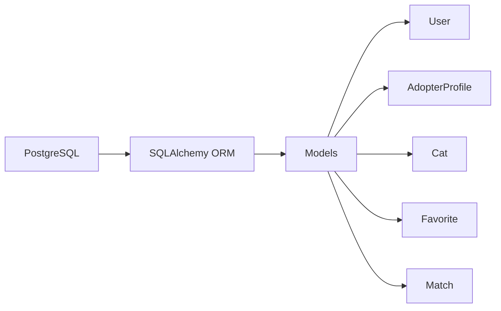
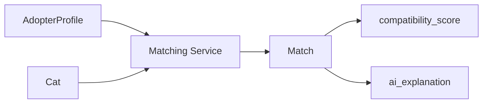
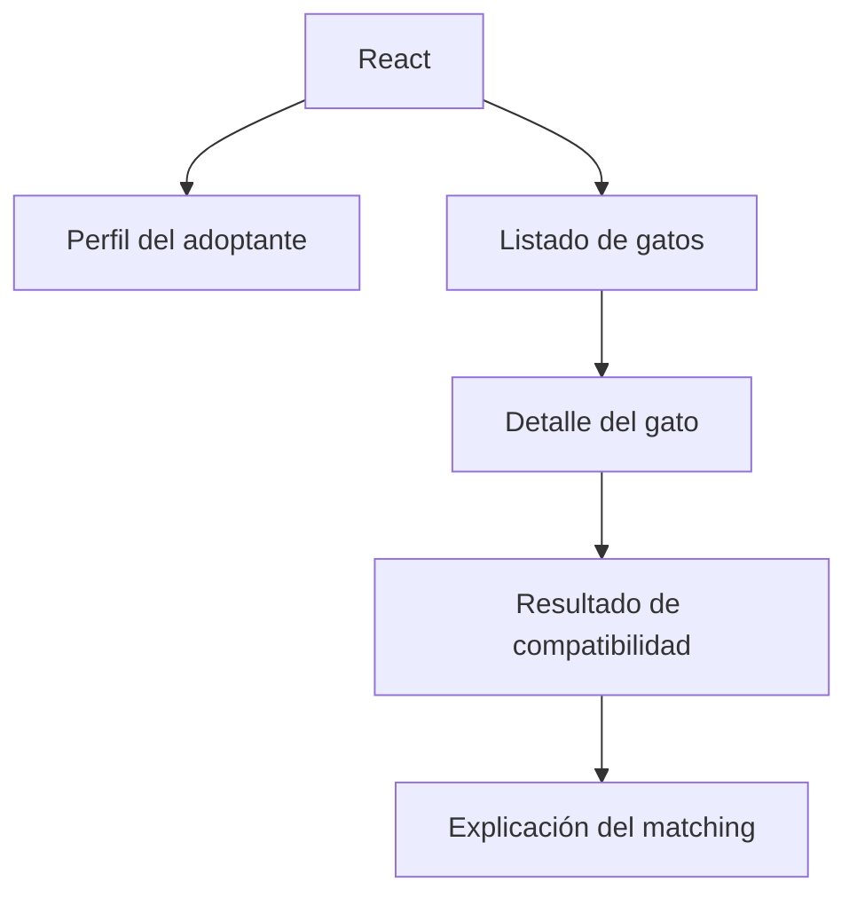

# Diseño del Modelo de Datos — Semana 1

Resumen: documento de diseño conceptual para el MVP de CatMatch. Contiene las cinco entidades acordadas, sus atributos clave, tipos recomendados (orientados a PostgreSQL), obligatoriedad, claves primarias y foráneas propuestas, restricciones importantes y vocabularios controlados para atributos de compatibilidad. No hay implementación de SQLAlchemy ni migraciones en este documento.

## Notas generales
- La IA para matching NO es entidad de BD; los resultados de matching se almacenan en la entidad `Match` como artefactos/resultados.
- Recomendación general de tipo para PK: `UUID` (tipo `uuid` de PostgreSQL) para facilitar distribución; `SERIAL/BIGSERIAL` es alternativa válida.
- Para campos con valores controlados se recomienda usar ENUMs de PostgreSQL o check constraints; como alternativa, almacenar en `JSONB`/array y validar a nivel de aplicación.
- Para campos flexibles (listas de rasgos, imágenes) se recomienda `JSONB` o arrays nativos de PostgreSQL.
- Timestamps: `TIMESTAMPTZ` con default `now()`.

---

## Entidad: Person
- Propósito: representar a la persona que busca adoptar (perfil sin cuenta). En la primera fase Person es la unidad principal de datos sobre el adoptante y NO depende de una cuenta `User`.
- Atributos principales:
  - `id` — Tipo: `UUID` — Obligatorio: sí — PK: sí.
  - `full_name` — Tipo: `VARCHAR(255)` — Obligatorio: no — Nombre o alias (útil para la ficha y comunicaciones, opcional para permitir anonimato inicial).
  - `bio` — Tipo: `TEXT` — Obligatorio: no — Descripción corta sobre estilo de vida y motivaciones.
  - `location` — Tipo: `VARCHAR(255)` — Obligatorio: no — Ciudad/estado o texto de ubicación (útil para filtrar por cercanía).
  - `household_type` — Tipo: `VARCHAR(20)` o ENUM — Valores: `alone`, `couple`, `family`, `other` — Obligatorio: no.
  - `has_children` — Tipo: `BOOLEAN` — Obligatorio: no — Default: `false`.
  - `has_other_pets` — Tipo: `BOOLEAN` — Obligatorio: no — Default: `false`.
  - `other_pets_details` — Tipo: `JSONB` — Obligatorio: no — Estructura opcional para describir mascotas existentes (lista de objetos con campos como `species`, `age`, `sex`, `neutered`, `temperament`); útil para evaluar compatibilidad con otros animales.
  - `activity_level` — Tipo: ENUM/`VARCHAR(10)` — Valores controlados (ver sección vocabulario) — Obligatorio: no.
  - `home_type` — Tipo: ENUM/`VARCHAR(20)` — Valores: `apartment`, `house`, `farm`, `other` — Obligatorio: no.
  - `home_size` — Tipo: ENUM/`VARCHAR(10)` — Valores sugeridos: `small`, `medium`, `large` — Obligatorio: no — Opcional para matizar disponibilidad de espacio interior.
  - `has_outdoor_space` — Tipo: `BOOLEAN` — Obligatorio: no — Indica si la vivienda dispone de acceso a exterior (jardín, patio, balcón seguro).
  - `work_hours_per_day` — Tipo: `SMALLINT` — Obligatorio: no — Indicador de tiempo fuera de casa que afecta la necesidad de compañía del gato.
  - `personality_traits` — Tipo: `JSONB` o `TEXT[]` — Obligatorio: no — Lista de rasgos seleccionados (valores controlados) que describen al adoptante.
  - `preferred_cat_traits` — Tipo: `JSONB` — Obligatorio: no — Preferencias (ej.: edad, tamaño, carácter) que ayudan al matching.
  - `created_at`, `updated_at` — `TIMESTAMPTZ`.
- Relaciones:
  - 1—N con `Match` (un Person puede tener múltiples matches contra diferentes Cats).
  - 1—N con `AdoptionRequest` (un Person puede enviar varias solicitudes a distintos Cats).
- Campos obligatorios / opcionales:
  - Obligatorios: `id`, `created_at`.
  - Opcionales: el resto (permitir crear perfiles ligeros sin requerir datos personales de contacto en esta fase).
- Información realmente necesaria para el matching:
  - `activity_level` (coincidir energía/actividad del gato y adoptante).
  - `personality_traits` (preferencias/rasgos compatibles).
  - `preferred_cat_traits` (filtros sobre edad/tamaño/rasgos especiales).
  - `has_children`, `has_other_pets`, `other_pets_details`, `home_type`, `home_size` y `has_outdoor_space` (factores de convivencia y disponibilidad de espacio).
  - `location` (para priorizar distancia/posibilidad logística).

---

## Entidad: Cat
- Propósito: representar los perfiles de gatos disponibles para adopción.
- Atributos principales (mínimos recomendados para el MVP):
  - `id` — Tipo: `UUID` — Obligatorio: sí — PK: sí.
  - `name` — Tipo: `VARCHAR(255)` — Obligatorio: sí.
  - `age_stage` — Tipo: ENUM/`VARCHAR(20)` — Valores: `kitten`, `young`, `adult`, `senior` — Obligatorio: sí.
  - `age_months` — Tipo: `SMALLINT` — Obligatorio: no.
  - `sex` — Tipo: ENUM/`VARCHAR(10)` — Valores: `female`, `male`, `unknown` — Obligatorio: no.
  - `breed` — Tipo: `VARCHAR(255)` — Obligatorio: no.
  - `size` — Tipo: ENUM/`VARCHAR(10)` — Valores: `small`, `medium`, `large` — Obligatorio: no.
  - `activity_level` — Tipo: ENUM/`VARCHAR(10)` — Valores controlados (mismo vocabulario que `Person`).
  - `personality_traits` — Tipo: `JSONB` o `TEXT[]` — Obligatorio: no — Rasgos (valores controlados) usados por el matching.
  - `good_with_children` — Tipo: `BOOLEAN` — Obligatorio: no.
  - `good_with_dogs` — Tipo: `BOOLEAN` — Obligatorio: no.
  - `vaccinated` — Tipo: `BOOLEAN` — Obligatorio: no.
  - `neutered` — Tipo: `BOOLEAN` — Obligatorio: no.
  - `health_status` — Tipo: `TEXT` — Obligatorio: no — Notas sobre condiciones médicas relevantes o necesidades especiales (p.ej. tratamientos crónicos, limitaciones de movilidad, requisitos de cuidado).
  - `description` — Tipo: `TEXT` — Obligatorio: no.
  - `image_urls` — Tipo: `JSONB` — Obligatorio: no — Lista de URLs de imágenes.
  - `location` — Tipo: `VARCHAR(255)` — Obligatorio: no — Ciudad/estado o refugio.
  - `created_at`, `updated_at` — `TIMESTAMPTZ`.
- Relaciones:
  - 1—N con `Match` (un Cat puede aparecer en muchos matches).
  - 1—N con `AdoptionRequest` (un Cat puede recibir múltiples solicitudes).
- Campos obligatorios / opcionales:
  - Obligatorios: `id`, `name`, `age_stage`, `created_at`.
  - Opcionales: resto (permite fichas mínimas para listar y hacer matching).
- Información realmente necesaria para el matching:
  - `activity_level`, `personality_traits`, `good_with_children`, `good_with_dogs`, `size`, `age_stage`, `health_status` y `location`.

---

## Entidad: Match
- Propósito: representar una evaluación de compatibilidad entre una `Person` y un `Cat`.
- Diseño MVP recomendado:
  - Opción A (no persistir inicialmente — cálculo al vuelo): calcular las compatibilidades cuando la UI/cliente lo solicite y devolver una lista ordenada por `compatibility_score`. No se requiere persistir Match en la DB para la primera fase; esto simplifica el esquema y evita duplicados/cachés innecesarios.
  - Opción B (persistir opcionalmente): guardar `Match` sólo si se desea cachear resultados, auditar decisiones o mostrar historiales. Si se persiste, usar la estructura mínima descrita abajo.
- Atributos (para la Opción B — persistida):
  - `id` — Tipo: `UUID` — PK.
  - `person_id` — Tipo: `UUID` — FK → `Person.id` — Obligatorio: sí.
  - `cat_id` — Tipo: `UUID` — FK → `Cat.id` — Obligatorio: sí.
  - `compatibility_score` — Tipo: `NUMERIC(5,2)` o `SMALLINT`/`INT` — Obligatorio: sí — Rango 0–100.
  - `explanation` — Tipo: `TEXT` — Obligatorio: no — Texto humano-legible con razones (puede ser breve).
  - `created_at` — Tipo: `TIMESTAMPTZ` — Default: `now()`.
- Relaciones:
  - `Person` 1—N `Match`.
  - `Cat` 1—N `Match`.
- Reglas y consideraciones:
  - Si se opta por no persistir (recomendado inicialmente), implementar caching a nivel de servicio sólo si es necesario.
  - Check constraint para `compatibility_score` (0 ≤ score ≤ 100) si se persiste.

---

## Entidad: AdoptionRequest
- Propósito: representar la solicitud formal de adopción de un `Person` para un `Cat`.
- Razonamiento MVP: dado que no hay cuentas, cada solicitud debe contener la información de contacto necesaria para que el refugio/proveedor contacte al solicitante; además puede vincularse al `Person` si existe un perfil previo.
- Atributos principales:
  - `id` — Tipo: `UUID` — PK.
  - `person_id` — Tipo: `UUID` — FK → `Person.id` — Opcional: sí — Si la solicitud se hace desde un perfil existente, vincular; si no, puede permanecer NULL y la información de contacto se almacena en los campos siguientes.
  - `cat_id` — Tipo: `UUID` — FK → `Cat.id` — Obligatorio: sí.
  - `contact_email` — Tipo: `VARCHAR(255)` — Obligatorio: sí — Medio principal de contacto en la fase inicial.
  - `contact_phone` — Tipo: `VARCHAR(50)` — Obligatorio: no — Opcional.
  - `message` — Tipo: `TEXT` — Obligatorio: no — Mensaje libre del solicitante.
  - `status` — Tipo: `VARCHAR(20)` o ENUM — Valores: `pending`, `contacted`, `rejected`, `accepted` — Default: `pending`.
  - `created_at`, `updated_at` — `TIMESTAMPTZ`.
- Relaciones:
  - `Person` 1—N `AdoptionRequest`.
  - `Cat` 1—N `AdoptionRequest`.
- Campos obligatorios / opcionales:
  - Obligatorios: `id`, `cat_id`, `contact_email`, `created_at`.
  - Opcionales: `person_id`, `contact_phone`, `message`, `status` (tiene default).

---

## Observaciones sobre Favorite
- Para el MVP principal (flujo de matching y solicitud de adopción) la funcionalidad de "favoritos" no es necesaria. Se puede dejar para una segunda tanda cuando haya cuentas y persistencia de preferencias.
- Recomendación: no crear la entidad `Favorite` en la primera fase. Si se desea una opción de marcado rápido sin cuentas, es preferible implementar almacenamiento local en el cliente o una tabla temporal vinculada a `AdoptionRequest`/`Person` más adelante.

---

## Notas de migración del modelo previo
- Se elimina la dependencia de `User`/cuentas en la primera fase: `Person` sustituye a `AdopterProfile` y existe de forma independiente.
- `Match` se simplifica: se puede calcular al vuelo; si se persiste, usar la estructura mínima indicada.
- `Favorite` queda fuera del MVP inicial.

---

---

## Vocabularios controlados (compatibilidad)
Se recomienda usar ENUMs o listas validadas por la aplicación para estas categorías:

1. `activity_level`:
   - Valores: `low`, `medium`, `high`
   - Uso: tanto en `AdopterProfile` como en `Cat`.

2. `personality_traits` (seleccionables; se permiten múltiples):
   - Valores recomendados: `playful`, `calm`, `affectionate`, `independent`, `shy`, `curious`, `vocal`, `lap_cat`
   - Almacenamiento: `TEXT[]` o `JSONB` array.

3. `age_stage` (para `Cat`):
   - Valores: `kitten`, `young`, `adult`, `senior`

4. `size`:
   - Valores: `small`, `medium`, `large`

5. `household_type` / `home_type`:
   - `alone`, `couple`, `family`, `apartment`, `house`, `farm`, `other`

Nota: mantener el mismo vocabulario entre `AdopterProfile` y `Cat` para facilitar el cálculo de compatibilidad (ej. `activity_level`, `personality_traits`).

---

## Índices y rendimiento (conceptual)
- Indexar columnas usadas en búsqueda/filtrado: `Cat.location`, `Cat.activity_level`, `Cat.age_stage`, `User.email`.
- Índice para FK: `Favorite.user_id`, `Favorite.cat_id`, `Match.adopter_profile_id`, `Match.cat_id`.
- Considerar `GIN` index para columnas `JSONB` o arrays (`personality_traits`) para búsquedas por rasgos.

---

## Validaciones y restricciones adicionales (conceptual)
- `email` único y not-null.
- `User` debe tener `password_hash` not-null.
- `AdopterProfile.user_id` unique (1—1).
- `compatibility_score` con check 0 ≤ score ≤ 100.
- `Favorite` par unique (`user_id`, `cat_id`) opcional para impedir duplicados.
- `personality_traits` solo con valores permitidos (validación en aplicación o constraint con función/procedimiento).

---

## Qué debe quedar claro para Semana 2 (preparación)
- Decidir tipos concretos de PK (`UUID` vs `SERIAL`) y si se usarán ENUMs de PostgreSQL o validación en aplicación.
- Definir el formato exacto de `ai_explanation` si se desea un esquema (texto plano vs JSON con partes).
- Confirmar índices prioritarios y parámetros de búsqueda esperados.
- Preparar migraciones una vez aprobado el diseño (Semana 2).

---

## Mapa de implementación futura

(Planificación visual y sencilla; PARA FUTURA IMPLEMENTACIÓN — NO ejecutar ahora)

1) PostgreSQL → SQLAlchemy → modelos


2) Arquitectura backend
```mermaid
flowchart LR
  Flask[Flask App]
  ModelsBackend[Models]
  Services[Services (business logic)]
  Routes[Routes / API]
  Frontend[Frontend (React)]
  Flask --> ModelsBackend --> Services --> Routes --> Frontend
```

3) Flujo de matching

(Explicación: `AdopterProfile` + `Cat` alimentan el `Matching Service` que produce `compatibility_score` y `ai_explanation`, guardados en `Match`.)

4) Flujo principal del frontend


5) Evolución por semanas (plan)
- Semana 1 → diseño y documentación (actual).
- Semana 2 → modelos, PostgreSQL y migraciones.
- Semanas posteriores → API, autenticación (JWT), frontend, matching, IA e integración, tests.

---

## Resumen ejecutivo
Documento listo para confirmación final: define cinco entidades (`User`, `AdopterProfile`, `Cat`, `Favorite`, `Match`) con campos y relaciones; el ajuste solicitado en `Match` ha sido aplicado (solo `id`, `adopter_profile_id`, `cat_id`, `compatibility_score`, `ai_explanation`, `created_at`). La sección "Mapa de implementación futura" añade la planificación visual para los siguientes hitos. NO se implementa código ni migraciones en este documento.

---

Fin del documento.
