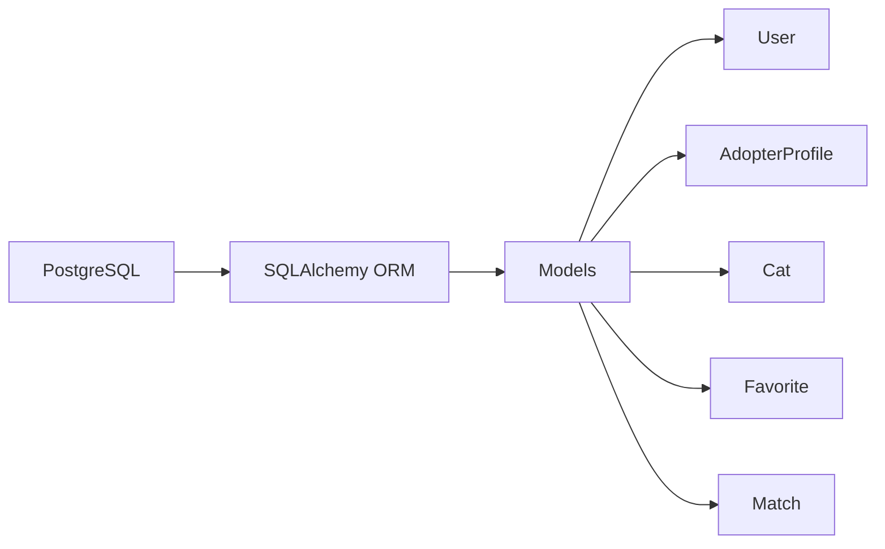
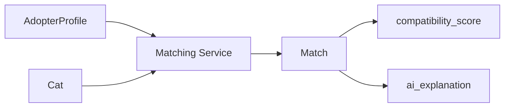
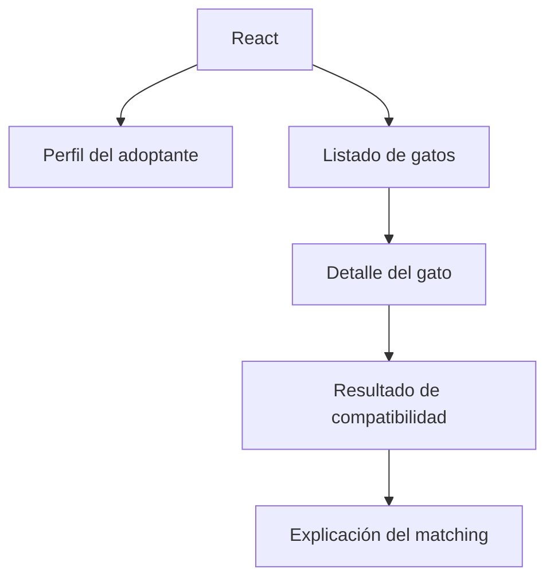

# Diseño del Modelo de Datos — Semana 1

Resumen: documento de diseño conceptual para el MVP de CatMatch. Contiene las cinco entidades acordadas, sus atributos clave, tipos recomendados (orientados a PostgreSQL), obligatoriedad, claves primarias y foráneas propuestas, restricciones importantes y vocabularios controlados para atributos de compatibilidad. No hay implementación de SQLAlchemy ni migraciones en este documento.

## Notas generales
- La IA para matching NO es entidad de BD; los resultados de matching se almacenan en la entidad `Match` como artefactos/resultados.
- Recomendación general de tipo para PK: `UUID` (tipo `uuid` de PostgreSQL) para facilitar distribución; `SERIAL/BIGSERIAL` es alternativa válida.
- Para campos con valores controlados se recomienda usar ENUMs de PostgreSQL o check constraints; como alternativa, almacenar en `JSONB`/array y validar a nivel de aplicación.
- Para campos flexibles (listas de rasgos, imágenes) se recomienda `JSONB` o arrays nativos de PostgreSQL.
- Timestamps: `TIMESTAMPTZ` con default `now()`.

---

## Entidad: User
- Propósito: representar la cuenta de usuario de la plataforma (credenciales y contacto).
- Atributos clave:
  - `id` — Tipo: `UUID` — Obligatorio: sí — PK: sí.
  - `email` — Tipo: `VARCHAR(255)` — Obligatorio: sí — Unique: sí — Index requerido.
  - `password_hash` — Tipo: `VARCHAR(255)` / `TEXT` — Obligatorio: sí.
  - `full_name` — Tipo: `VARCHAR(255)` — Obligatorio: no.
  - `is_active` — Tipo: `BOOLEAN` — Obligatorio: sí — Default: `true`.
  - `created_at` — Tipo: `TIMESTAMPTZ` — Obligatorio: sí — Default: `now()`.
  - `updated_at` — Tipo: `TIMESTAMPTZ` — Obligatorio: no — Actualizar en modificación.
- Claves y relaciones:
  - PK: `id`.
  - Relación 1—1 con `AdopterProfile` (ver `AdopterProfile.user_id`).
  - Relación 1—N con `Favorite` (ver `Favorite.user_id`).
- Restricciones importantes:
  - `email` NOT NULL + UNIQUE.
  - `password_hash` NOT NULL.
  - Índice en `email` para búsqueda/autenticación.
  - Validación del formato de email a nivel de aplicación.

---

## Entidad: AdopterProfile
- Propósito: almacenar detalles personales y preferencias del adoptante usados para matching.
- Atributos clave:
  - `id` — Tipo: `UUID` — Obligatorio: sí — PK: sí.
  - `user_id` — Tipo: `UUID` — Obligatorio: sí — FK → `User.id` (1—1).
  - `bio` — Tipo: `TEXT` — Obligatorio: no.
  - `location` — Tipo: `VARCHAR(255)` — Obligatorio: no (preferible ciudad/estado o geo).
  - `household_type` — Tipo: `VARCHAR(20)` o ENUM — Valores: `alone`, `couple`, `family`, `other` — Obligatorio: no.
  - `has_children` — Tipo: `BOOLEAN` — Obligatorio: no — Default: `false`.
  - `has_other_pets` — Tipo: `BOOLEAN` — Obligatorio: no — Default: `false`.
  - `activity_level` — Tipo: ENUM/`VARCHAR(10)` — Valores controlados (ver sección vocabulario) — Obligatorio: no.
  - `home_type` — Tipo: ENUM/`VARCHAR(20)` — Valores: `apartment`, `house`, `farm`, `other` — Obligatorio: no.
  - `work_hours_per_day` — Tipo: `SMALLINT` — Obligatorio: no.
  - `personality_traits` — Tipo: `JSONB` o `TEXT[]` — Obligatorio: no — Lista de rasgos seleccionados (valores controlados).
  - `preferred_cat_traits` — Tipo: `JSONB` — Obligatorio: no — Estructura para preferencia (p. ej. edad, tamaño, personalidad).
  - `created_at`, `updated_at` — `TIMESTAMPTZ`.
- Claves y relaciones:
  - PK: `id`.
  - FK: `user_id` → `User.id` (1—1).
  - Relación 1—N con `Match` (ver `Match.adopter_profile_id`).
- Restricciones importantes:
  - Unique constraint en `user_id` para garantizar 1—1 entre `User` y `AdopterProfile`.
  - Validaciones en la aplicación para formatos y límites (`work_hours_per_day` ≥ 0).

---

## Entidad: Cat
- Propósito: representar los perfiles de gatos disponibles para adopción.
- Atributos clave:
  - `id` — Tipo: `UUID` — Obligatorio: sí — PK: sí.
  - `name` — Tipo: `VARCHAR(255)` — Obligatorio: sí.
  - `age_stage` — Tipo: ENUM/`VARCHAR(20)` — Valores: `kitten`, `young`, `adult`, `senior` — Obligatorio: sí.
  - `age_months` — Tipo: `SMALLINT` — Obligatorio: no — Si se requiere precisión.
  - `sex` — Tipo: ENUM/`VARCHAR(10)` — Valores: `female`, `male`, `unknown` — Obligatorio: no.
  - `breed` — Tipo: `VARCHAR(255)` — Obligatorio: no.
  - `size` — Tipo: ENUM/`VARCHAR(10)` — Valores: `small`, `medium`, `large` — Obligatorio: no.
  - `activity_level` — Tipo: ENUM/`VARCHAR(10)` — Valores controlados (mismo vocabulario que `AdopterProfile`) — Obligatorio: no.
  - `personality_traits` — Tipo: `JSONB` o `TEXT[]` — Obligatorio: no — Lista de rasgos (valores controlados).
  - `good_with_children` — Tipo: `BOOLEAN` — Obligatorio: no.
  - `good_with_dogs` — Tipo: `BOOLEAN` — Obligatorio: no.
  - `vaccinated` — Tipo: `BOOLEAN` — Obligatorio: no.
  - `neutered` — Tipo: `BOOLEAN` — Obligatorio: no.
  - `description` — Tipo: `TEXT` — Obligatorio: no.
  - `image_urls` — Tipo: `JSONB` — Obligatorio: no — Lista de URLs.
  - `location` — Tipo: `VARCHAR(255)` — Obligatorio: no.
  - `created_at`, `updated_at` — `TIMESTAMPTZ`.
- Claves y relaciones:
  - PK: `id`.
  - Relación 1—N con `Favorite` (ver `Favorite.cat_id`).
  - Relación 1—N con `Match` (ver `Match.cat_id`).
- Restricciones importantes:
  - Indexes para búsquedas por `age_stage`, `activity_level`, `location`.
  - Validaciones en la aplicación para URLs en `image_urls`.

---

## Entidad: Favorite
- Propósito: registrar los gatos marcados como favoritos por usuarios.
- Atributos clave:
  - `id` — Tipo: `UUID` — Obligatorio: sí — PK: sí.
  - `user_id` — Tipo: `UUID` — Obligatorio: sí — FK → `User.id`.
  - `cat_id` — Tipo: `UUID` — Obligatorio: sí — FK → `Cat.id`.
  - `created_at` — Tipo: `TIMESTAMPTZ` — Obligatorio: sí — Default: `now()`.
- Claves y relaciones:
  - PK: `id`.
  - FK: `user_id` → `User.id`; `cat_id` → `Cat.id`.
  - Relación: User 1—N Favorite; Cat 1—N Favorite.
- Restricciones importantes:
  - Unique constraint opcional (`user_id`, `cat_id`) para impedir duplicados.
  - Índices en `user_id` y `cat_id` para consultas rápidas.

---

## Entidad: Match (ajustada)
- Propósito: almacenar resultados/recomendaciones de compatibilidad generados por el componente AI (artefactos de matching).
- Atributos clave (únicamente):
  - `id` — Tipo: `UUID` — Obligatorio: sí — PK: sí.
  - `adopter_profile_id` — Tipo: `UUID` — Obligatorio: sí — FK → `AdopterProfile.id`.
  - `cat_id` — Tipo: `UUID` — Obligatorio: sí — FK → `Cat.id`.
  - `compatibility_score` — Tipo: `NUMERIC(5,2)` o `SMALLINT`/`INT` — Obligatorio: sí — Representa porcentaje 0–100.
  - `ai_explanation` — Tipo: `TEXT` — Obligatorio: no — Explicación comprensible (texto) de por qué se considera la compatibilidad.
  - `created_at` — Tipo: `TIMESTAMPTZ` — Default: `now()`.
- Claves y relaciones:
  - PK: `id`.
  - FK: `adopter_profile_id` → `AdopterProfile.id`.
  - FK: `cat_id` → `Cat.id`.
  - Relación: AdopterProfile 1—N Match; Cat 1—N Match.
- Restricciones importantes:
  - Check constraint en `compatibility_score` para asegurar 0 ≤ score ≤ 100.
  - Índices (`adopter_profile_id`, `cat_id`) para búsquedas.
  - Unique constraint opcional en (`adopter_profile_id`, `cat_id`) si se desea evitar duplicados por pareja.

---

## Vocabularios controlados (compatibilidad)
Se recomienda usar ENUMs o listas validadas por la aplicación para estas categorías:

1. `activity_level`:
   - Valores: `low`, `medium`, `high`
   - Uso: tanto en `AdopterProfile` como en `Cat`.

2. `personality_traits` (seleccionables; se permiten múltiples):
   - Valores recomendados: `playful`, `calm`, `affectionate`, `independent`, `shy`, `curious`, `vocal`, `lap_cat`
   - Almacenamiento: `TEXT[]` o `JSONB` array.

3. `age_stage` (para `Cat`):
   - Valores: `kitten`, `young`, `adult`, `senior`

4. `size`:
   - Valores: `small`, `medium`, `large`

5. `household_type` / `home_type`:
   - `alone`, `couple`, `family`, `apartment`, `house`, `farm`, `other`

Nota: mantener el mismo vocabulario entre `AdopterProfile` y `Cat` para facilitar el cálculo de compatibilidad (ej. `activity_level`, `personality_traits`).

---

## Índices y rendimiento (conceptual)
- Indexar columnas usadas en búsqueda/filtrado: `Cat.location`, `Cat.activity_level`, `Cat.age_stage`, `User.email`.
- Índice para FK: `Favorite.user_id`, `Favorite.cat_id`, `Match.adopter_profile_id`, `Match.cat_id`.
- Considerar `GIN` index para columnas `JSONB` o arrays (`personality_traits`) para búsquedas por rasgos.

---

## Validaciones y restricciones adicionales (conceptual)
- `email` único y not-null.
- `User` debe tener `password_hash` not-null.
- `AdopterProfile.user_id` unique (1—1).
- `compatibility_score` con check 0 ≤ score ≤ 100.
- `Favorite` par unique (`user_id`, `cat_id`) opcional para impedir duplicados.
- `personality_traits` solo con valores permitidos (validación en aplicación o constraint con función/procedimiento).

---

## Qué debe quedar claro para Semana 2 (preparación)
- Decidir tipos concretos de PK (`UUID` vs `SERIAL`) y si se usarán ENUMs de PostgreSQL o validación en aplicación.
- Definir el formato exacto de `ai_explanation` si se desea un esquema (texto plano vs JSON con partes).
- Confirmar índices prioritarios y parámetros de búsqueda esperados.
- Preparar migraciones una vez aprobado el diseño (Semana 2).

---

## Mapa de implementación futura

(Planificación visual y sencilla; PARA FUTURA IMPLEMENTACIÓN — NO ejecutar ahora)

1) PostgreSQL → SQLAlchemy → modelos


2) Arquitectura backend
```mermaid
flowchart LR
  Flask[Flask App]
  ModelsBackend[Models]
  Services[Services (business logic)]
  Routes[Routes / API]
  Frontend[Frontend (React)]
  Flask --> ModelsBackend --> Services --> Routes --> Frontend
```

3) Flujo de matching

(Explicación: `AdopterProfile` + `Cat` alimentan el `Matching Service` que produce `compatibility_score` y `ai_explanation`, guardados en `Match`.)

4) Flujo principal del frontend


5) Evolución por semanas (plan)
- Semana 1 → diseño y documentación (actual).
- Semana 2 → modelos, PostgreSQL y migraciones.
- Semanas posteriores → API, autenticación (JWT), frontend, matching, IA e integración, tests.

---

## Resumen ejecutivo
Documento listo para confirmación final: define cinco entidades (`User`, `AdopterProfile`, `Cat`, `Favorite`, `Match`) con campos y relaciones; el ajuste solicitado en `Match` ha sido aplicado (solo `id`, `adopter_profile_id`, `cat_id`, `compatibility_score`, `ai_explanation`, `created_at`). La sección "Mapa de implementación futura" añade la planificación visual para los siguientes hitos. NO se implementa código ni migraciones en este documento.

---

Fin del documento.
